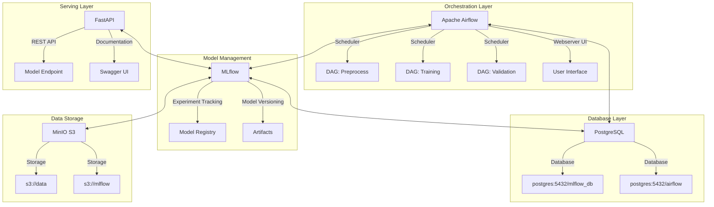

# Sistema MLOps para Predicción de Precios de Vehículos
### MLOps1 - CEIA - FIUBA

Estructura de servicios para implementación de un sistema completo de MLOps para predicción de precios de vehículos.

## Grupo de Trabajo
- Nicolas Pinzon Aparicio (a1820)
- Daniel Fernando Peña Pinzon (a1818)
- Cesar Raúl Alan Cruz Gutierrez (2544003)
- Federico Martin Zoya (a1828)

## Descripción del Proyecto

Este proyecto implementa un ambiente productivo para MLOps que consta de varios servicios:

- **Apache Airflow**: Orquestación del pipeline ML (preprocesamiento, entrenamiento y validación)
- **MLflow**: Seguimiento de experimentos, registro y gestión de modelos
- **FastAPI**: API REST para servir modelos en producción
- **MinIO**: Almacenamiento compatible con S3 (data lake)
- **PostgreSQL**: Base de datos para Airflow y MLflow



## Requisitos Previos

- [Docker](https://docs.docker.com/engine/install/) y Docker Compose
- Git

## Instalación y Ejecución

1. Clonar este repositorio:
   ```bash
   git clone <url-del-repositorio>
   cd amq2-service-ml
   ```

2. Crear la estructura de directorios necesaria:
   ```bash
   mkdir -p airflow/config airflow/dags airflow/logs airflow/plugins airflow/secrets
   ```

3. Configurar el ID de usuario (solo para Linux/MacOS):
   - Editar el archivo `.env`
   - Reemplazar `AIRFLOW_UID` con tu ID de usuario: `id -u`

4. **Importante**: El puerto predeterminado para MLflow (5000) podría estar en uso. En ese caso, se ha modificado para usar el puerto 5001 en el archivo `.env` y `docker-compose.yaml`.

5. Iniciar todos los servicios:
   ```bash
   docker compose --profile all up
   ```

6. Acceder a los servicios:
   - **Apache Airflow**: http://localhost:8080 (usuario: airflow, contraseña: airflow)
   - **MLflow**: http://localhost:5001
   - **MinIO**: http://localhost:9001 (usuario: minio, contraseña: minio123)
   - **API**: http://localhost:8800/
   - **Documentación API**: http://localhost:8800/docs

## Pipeline de Datos y ML

El sistema implementa un flujo de trabajo completo para la predicción de precios de vehículos:

1. **Preprocesamiento**: Limpieza y transformación de datos de vehículos
2. **Entrenamiento**: Entrenamiento de modelos XGBoost y Ridge
3. **Validación**: Evaluación de precisión de los modelos

## Detener los Servicios

Para detener los servicios:
```bash
docker compose --profile all down
```

Para eliminar completamente la infraestructura (incluyendo volúmenes y datos):
```bash
docker compose down --rmi all --volumes
```

## Solución de Problemas

- **Puerto 5000 en uso**: Si encuentra un error relacionado con el puerto 5000, revise la configuración en `.env` y `docker-compose.yaml`. El servicio MLflow ahora usa el puerto 5001.
- **Problemas de permisos**: Verifique la configuración de AIRFLOW_UID en el archivo `.env`.

## Conexión con los Buckets

Para conectar con MinIO, configure las siguientes variables de entorno:

```bash
AWS_ACCESS_KEY_ID=minio
AWS_SECRET_ACCESS_KEY=minio123
AWS_ENDPOINT_URL_S3=http://localhost:9000
MLFLOW_S3_ENDPOINT_URL=http://localhost:9000
```

## Uso de MLflow

Este proyecto utiliza MLflow para el seguimiento de experimentos. Los artefactos se almacenan en el bucket `mlflow` en MinIO.

## Licencia

Ver archivo LICENSE para detalles.
